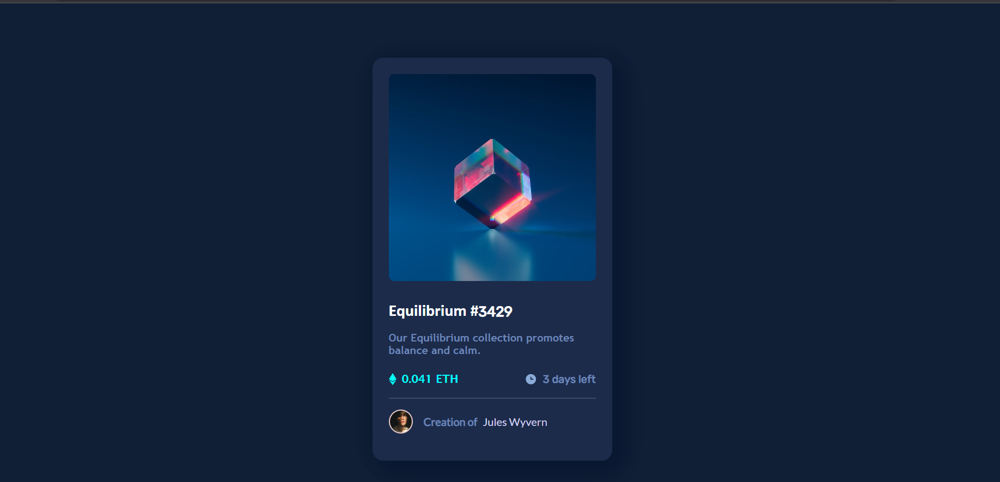
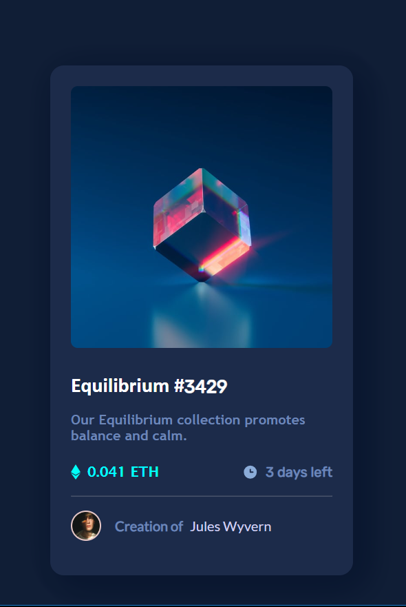
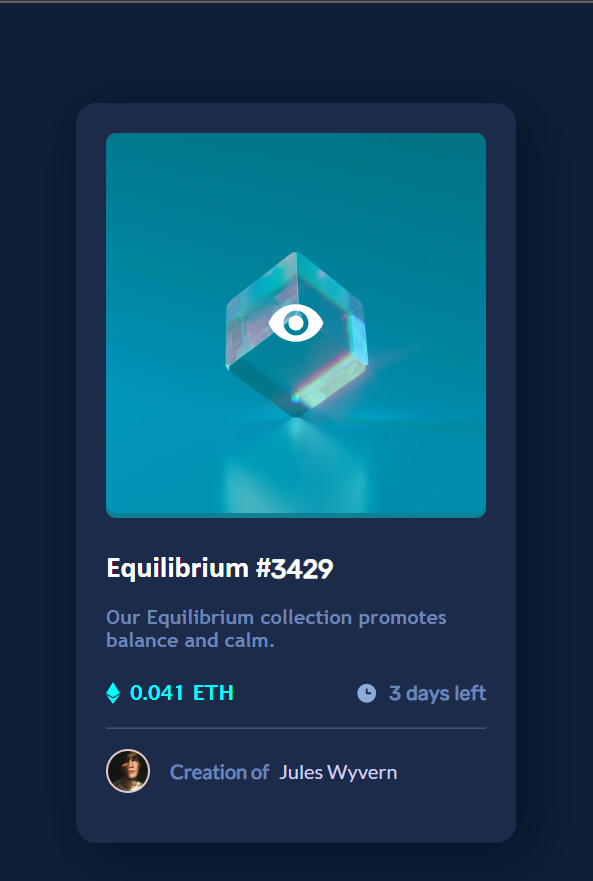

# Frontend Mentor - NFT preview card component solution

This is a solution to the [NFT preview card component challenge on Frontend Mentor](https://www.frontendmentor.io/challenges/nft-preview-card-component-SbdUL_w0U). Frontend Mentor challenges help you improve your coding skills by building realistic projects. 

## Table of contents

- [Overview](#overview)
  - [The challenge](#the-challenge)
  - [Screenshot](#screenshot)
  - [Links](#links)
- [My process](#my-process)
  - [Built with](#built-with)
  - [What I learned](#what-i-learned)
  - [Continued development](#continued-development)
  - [Useful resources](#useful-resources)
- [Author](#author)
- [Acknowledgments](#acknowledgments)

**Note: Delete this note and update the table of contents based on what sections you keep.**

## Overview

### The challenge

Users should be able to:

- View the optimal layout depending on their device's screen size
- See hover states for interactive elements

### Screenshot

>### Desktop View
>

>### Mobile View
>

>### Active State
>


### Links

- Solution URL: [Add solution URL here](https://your-solution-url.com)
- Live Site URL: [https://lambdola.github.io](https://lambdola.github.io)

## My process

### Built with

- Semantic HTML5 markup
- CSS custom properties
- Flexbox
- Mobile-first workflow
- CSS relative units

### What I learned

>I learned how use and relate child-parent elements with the relative and absolute style position. I used it to add the active/ hover state of the image-equilibrium.

```html
<div id="image-container">
  <div id="image-screen"></div>
  
  
</div>
```
> I learnt how to use the var() and :root in CSS
```css
:root {
    --background-color:  #091730f7;
}

box-shadow: 5px 5px 40px var(--background-color), 10px 10px 40px var(--background-color), 15px 15px 40px var(--background-color);
```


### Continued development

I would like to further understand about how the position style affects elements in DOM and how they can be used together. 


### Useful resources

- [How to apply shadow to an element](https://www.w3schools.com/css/css3_shadows_box.asp) - In my inspection of the designs in the designs folder, i noticed some shadows around the card. This page really helped me out on how to apply shadow to a box.
- [Google Fonts](https://fonts.google.com/) - Google Fonts helped me with the font family used in the design as i was doing design by inspection.


## Author

- Website - [A Project of mine](https://lambdola.github.io/aeefinalproject.github.io)
- Twitter - [@elijahdimeji549](https://www.twitter.com/@elijahdimeji549)


## Acknowledgments

I came across this challenge from a friend who asked me to use my laptop to open and view some files for her. I went through the content of the file and saw that the challenge was cool and pleasing to try; so i want to give a shout-out and a big thanks to her as she brought this to my notice.

i also want to thank my friends who were helping me match the colours of the design by eyesight inspection as i didnt know/see the style-guide.md beforehand. I had to find and match the colours and styles myself.

